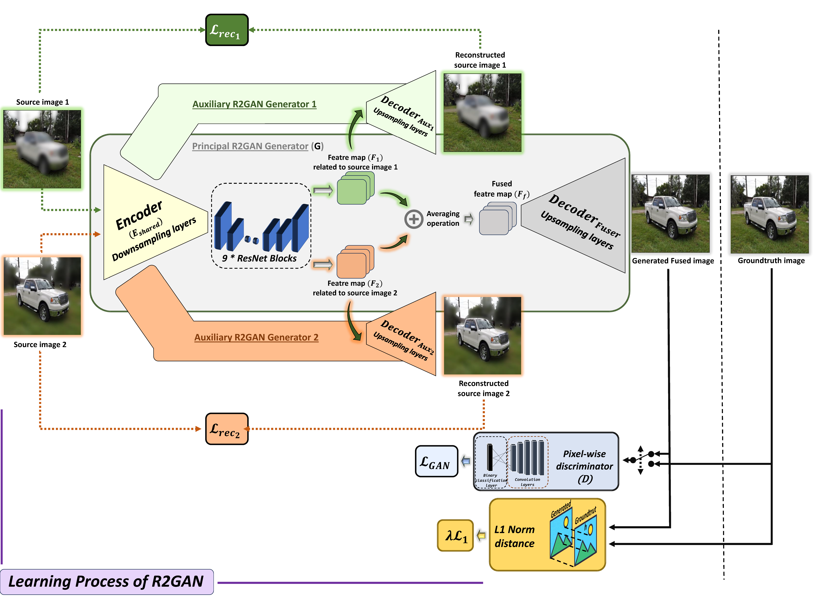
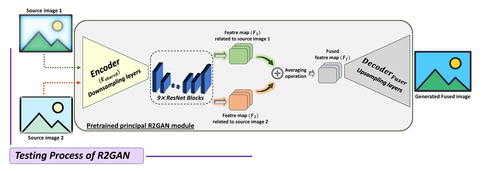
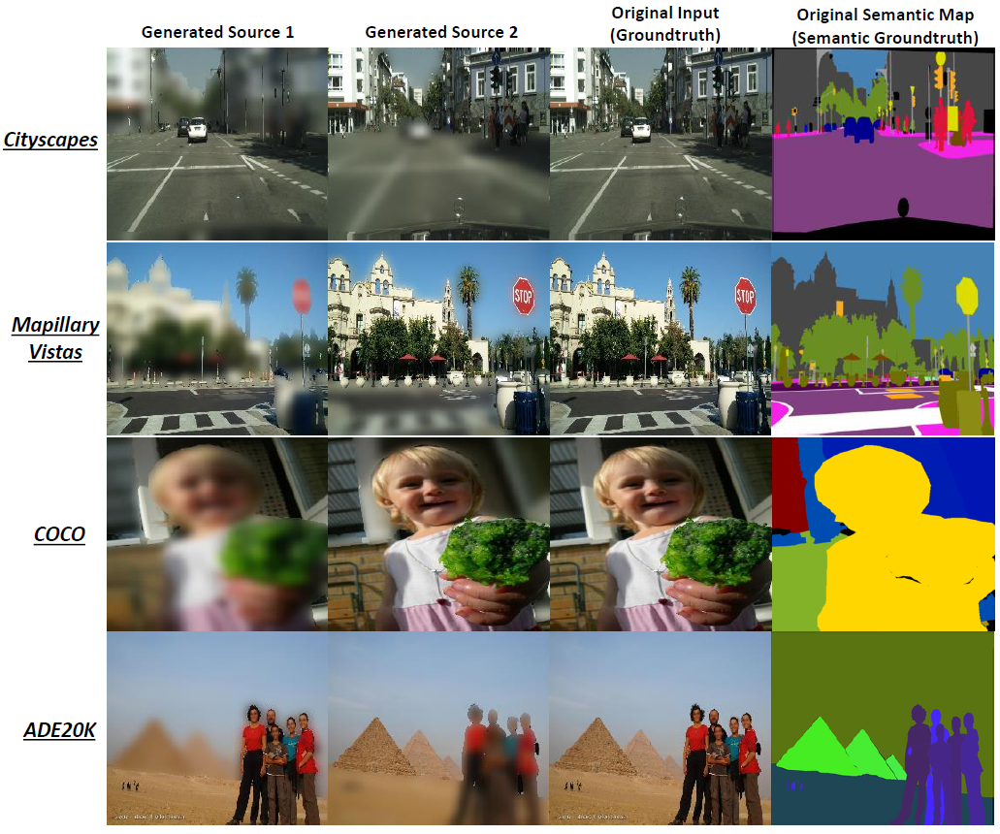

# R2GAN: Enhancing Unseen Image Fusion with Reconstruction-Guided Generative Adversarial Network

Abderrazak Chahi · Mohamed Kas · Ibrahim Kajo · Yassine Ruichek

This repository is the official PyTorch implementation of R2GAN. The code is based on pytorch-CycleGAN-and-pix2pix repository in [<a href="https://github.com/junyanz/pytorch-CycleGAN-and-pix2pix">here</a>].

The paper is submitted to Applied Intelligence Journal


## Abstract 
<p align="justify">
Generative Adversarial Networks (GANs) have gained significant prominence in the field of computer vision, and their application extends to various image generation tasks, including image fusion. This paper introduces a novel generative adversarial network, termed the Reconstruction-Guided Generative Adversarial Network (R2GAN), designed to address the challenges of general image fusion. The R2GAN architecture consists of three-pathway generators. The main generator is specifically designed to improve image fusion capabilities, whereas auxiliary generators concentrate on enhancing the reconstruction of features related to the source images. To optimize the network, we introduce a novel loss function known as the reconstruction guided loss. It is designed to preserve the feature distribution of each source image, guiding the primary R2GAN generator to capture the consistency between the fused image and the source images more effectively. The R2GAN is a generic network, which applies to diverse, unseen fusion tasks with unseen data, obviating the need for any fine-tuning procedures or the use of multiple individually trained models. These tasks encompass visible and infrared fusion, medical image fusion, and multi-focus image fusion. To train the R2GAN model, we employed a sophisticated semantic segmentation-guided strategy to generate a comprehensive and realistic Paired Multi-Focus image dataset (PMF). This involved creating high-resolution pairs that showcase partially focused images. Experimental results for visible and infrared fusion, medical image fusion, and multi-focus image fusion demonstrate that the proposed R2GAN produces enhanced fusion outcomes, achieving superior performance compared to current state-of-the-art image fusion approaches.
</p>


## R2GAN overall architecture
<h3> Learning process of R2GAN </h3>

<h3> Testing process of R2GAN </h3>


## Before train
### Recommended environments
- Linux or Win64
- Python 3.7 or above
- NVIDIA GPU + CUDA CuDNN >=11.3
- PyToch 1.10 or above
### Install R2GAN
Install the required packages (PyTorch, Torchvision, PyTorch Cuda toolkit, OpenCV, Visdom,...). We recommand to use the following Conda environnement depending on the OS:
  - Linux :
    ```bash
    conda env create -f environment_linux.yml
    ```
  - Win 64:
    ```bash
    conda env create -f environment_win64.yml
    ```
  - For pip users, please refer to requirements.txt file to install the packages using pip command :
    ```bash
      pip install -r requirements.txt
    ```
### Proposed PMF training dataset
To comprehensively train the R2GAN model, we propose generating an extensive and realistic Paired Multi-Focus (PMF) image dataset. This is achieved by introducing a sophisticated semantic segmentation-guided strategy to create high-resolution pairs featuring partially focused images. The RGB visible images and their corresponding semantic ground truth maps are collected from Cityscapes, Mapillary Vistas, COCO, and ADE20K.
[<a href="https://utbm-my.sharepoint.com/:u:/g/personal/abderrazak_chahi_utbm_fr/EYe6A8HBY2VBqlYjImeRDOgBdosofEpbNzdLXIXDZakM5g?e=nNbe3A">PMF download link</a>][<a href="https://github.com/CHAHI24680/R2GAN/blob/main/Code/Generate_PMF_train_dataset.py">PMF generation code link</a>].

### Unseen testing datasets
To validate the performance of the R2GAN framework, we targeted the well-known image fusion applications of visible and infrared fusion, multimodality medical image fusion, and multi-focus image fusion. The R2GAN is trained on the PMF dataset and tested on the following unseen datasets: 
* Visible and infrared fusion, [<a href="https://figshare.com/articles/dataset/TNO_Image_Fusion_Dataset/1008029">TNO dataset</a>].
* Multi-modality medical image fusion, [<a href="https://www.med.harvard.edu/AANLIB/home.html">MD dataset</a>].
* Multi-focus image fusion, [<a href="https://mansournejati.ece.iut.ac.ir/content/lytro-multi-focus-dataset">Lytro dataset</a>].

** Please download and extract the datasets into their respective folders within the `datasets` root directory. Your directory structure should look like this:

```
$R2GAN/Code/datasets
├── TNO
│   └── test
├── Lytro
│   └── test
├── MD
│   └── test
├── PMF
│   ├── train
```
## To train
Before running the training script, to view the training results and loss plots, run the Visdom visualizer in a separate shell using `python -m visdom.server`, then click the URL http://localhost:8097.

To train the R2GAN model on the PMF dataset, run the following command using two GPUs (as an example):
  ```bash
    python train.py --dataroot datasets/PMF --model pix2pix --gpu_ids 0,1 --netG R2GAN_generator --netD pixel --batch_size 8 --verbose --name PMF_R2GAN
  ```
The trained R2GAN model will be saved to `./checkpoints/PMF_R2GAN`. To view more intermediate training results, please check out `./checkpoints/PMF_R2GAN/web/index.html`. 

Note that the `base_options.py` and `train_options.py` files contain the optimal training parameters, which can also be set as arguments in the training `python train.py` command.

## To test
To evaluate the R2GAN model on a specific unseen fusion task, run the following command using the training options you selected:
```bash
    python test.py --dataroot datasets/Lytro --model pix2pix  --gpu_ids 0,1 --netG R2GAN_generator --batch_size 8 --verbose --name PMF_R2GAN --eval
  ```
To find the used parameters please check the config file located in `checkpoints/PMF_R2GAN/train_opt.txt`. 

The test fusion results will be saved to an HTML file here: `./results/PMF_R2GAN/test_latest/index.html`. You can find more scripts in the `scripts` directory.
