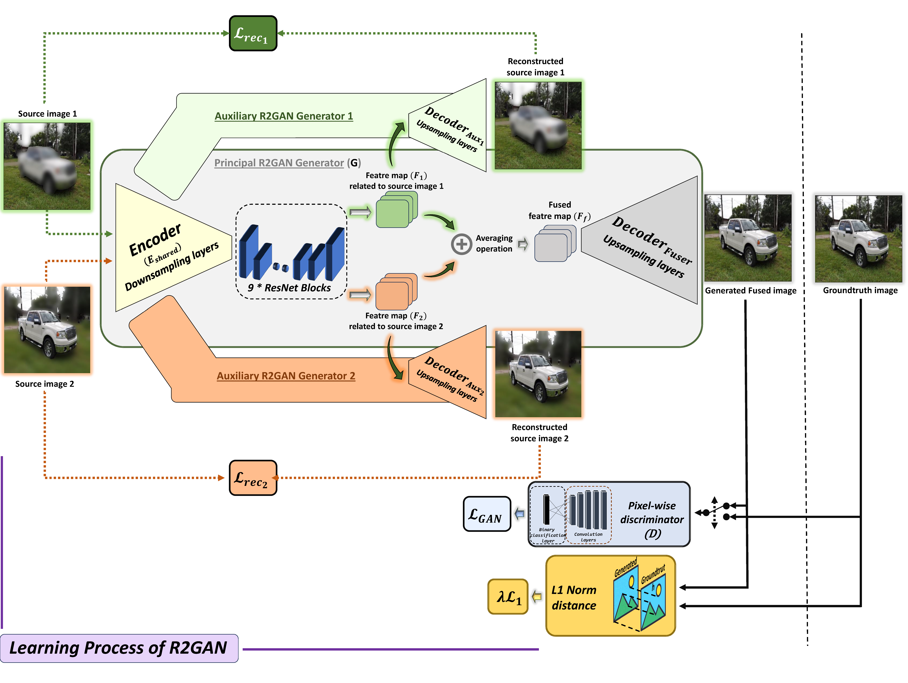
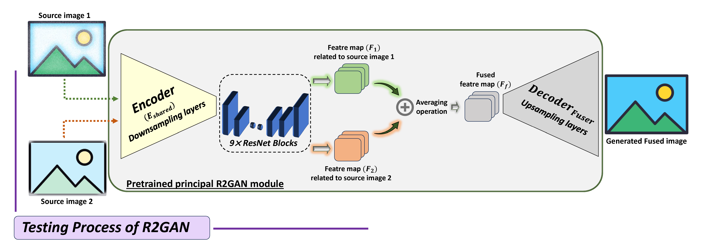
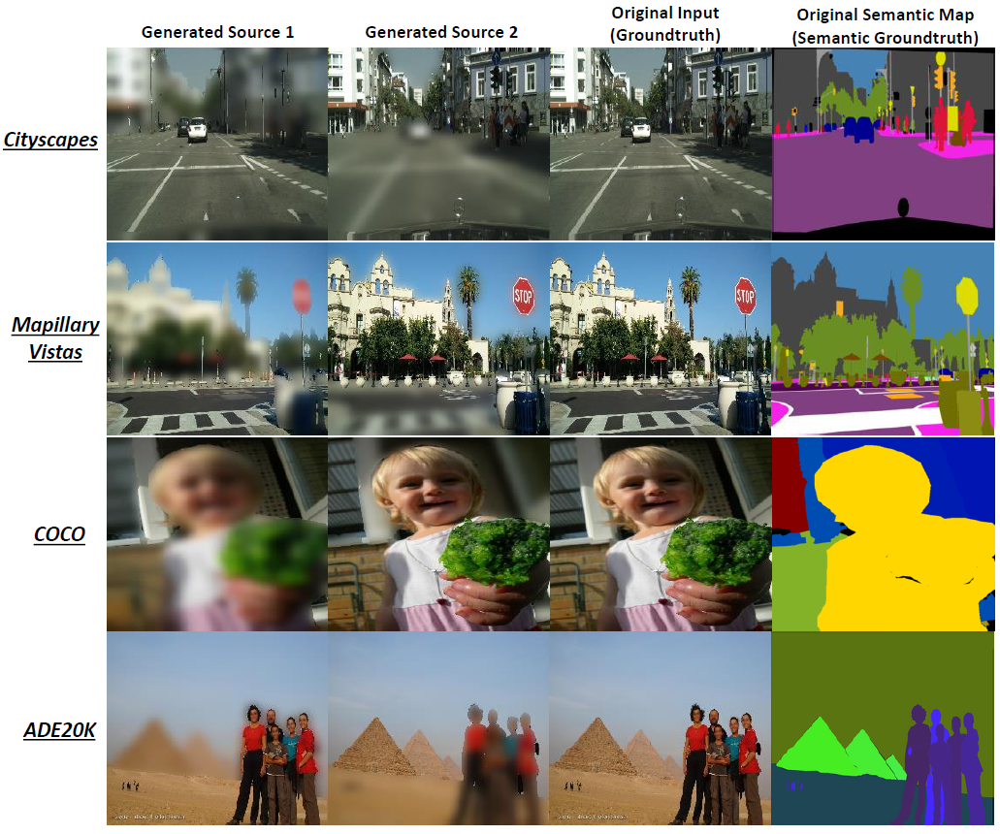

# R2GAN: Enhancing unseen image fusion with reconstruction-guided generative adversarial Network

**Abderrazak Chahi · Mohamed Kas · Ibrahim Kajo · Yassine Ruichek**

[](https://link.springer.com/article/10.1007/s10489-025-06610-2)
[](https://doi.org/10.1007/s10489-025-06610-2)
[](https://pytorch.org/)

This repository provides the official PyTorch implementation of **R2GAN**, published in *Applied Intelligence*, Volume 55, Article 821 (2025).

> **Paper:** A. Chahi, M. Kas, I. Kajo, and Y. Ruichek, “R2GAN: Enhancing unseen image fusion with reconstruction-guided generative adversarial network,” *Applied Intelligence*, vol. 55, article 821, 2025.
> **DOI:** [10.1007/s10489-025-06610-2](https://doi.org/10.1007/s10489-025-06610-2)

The implementation is built upon the [pytorch-CycleGAN-and-pix2pix](https://github.com/junyanz/pytorch-CycleGAN-and-pix2pix) repository.

## Abstract

<p align="justify">
Generative Adversarial Networks (GANs) have become widely used in computer vision, including image-fusion applications. However, many existing fusion methods depend on task-specific training, labeled data, or separately trained models, which limits their generalization to unseen fusion scenarios. R2GAN addresses this limitation through a reconstruction-guided adversarial framework composed of a primary fusion generator and two auxiliary reconstruction generators. The auxiliary pathways preserve the feature distributions of the source images and guide the primary generator through a reconstruction-guided loss, improving consistency between the fused output and its inputs. A single R2GAN model can therefore be applied to visible–infrared, multimodal medical, and multi-focus image fusion without task-specific fine-tuning. To train the framework, we introduce a semantic-segmentation-guided strategy for generating a realistic Paired Multi-Focus (PMF) dataset containing high-resolution partially focused image pairs. Experiments across unseen fusion tasks show that R2GAN produces high-quality fused images and achieves competitive or superior performance compared with state-of-the-art image-fusion approaches.
</p>

## Main Features

* A generic image-fusion model trained once and evaluated on multiple unseen fusion tasks.
* A three-generator architecture containing one primary fusion generator and two auxiliary reconstruction generators.
* A reconstruction-guided loss that preserves source-image feature distributions.
* A semantic-segmentation-guided strategy for generating the Paired Multi-Focus (PMF) training dataset.
* Evaluation on visible–infrared, multimodal medical, and multi-focus image fusion.

## R2GAN Architecture

### Training Process

<p align="center">
  
</p>

### Inference Process

<p align="center">
  
</p>

## Environment

### Recommended Configuration

* Linux or Windows 64-bit
* Python 3.7 or later
* NVIDIA GPU
* CUDA 11.3 or later with a compatible cuDNN version
* PyTorch 1.10 or later

## Installation

Clone the repository and enter the code directory:

```bash
git clone https://github.com/CHAHI24680/R2GAN.git
cd R2GAN/Code
```

Install the required packages using one of the following methods.

### Conda on Linux

```bash
conda env create -f environment_linux.yml
```

### Conda on Windows 64-bit

```bash
conda env create -f environment_win64.yml
```

### Pip

```bash
pip install -r requirements.txt
```

## Datasets

### Paired Multi-Focus Training Dataset

We introduce the **Paired Multi-Focus (PMF)** dataset to train R2GAN. PMF is generated using a semantic-segmentation-guided strategy that creates high-resolution pairs of partially focused images. The RGB images and their corresponding semantic annotations are collected from Cityscapes, Mapillary Vistas, COCO, and ADE20K.

* [Download the PMF dataset](https://utbm-my.sharepoint.com/:u:/g/personal/abderrazak_chahi_utbm_fr/EYe6A8HBY2VBqlYjImeRDOgBdosofEpbNzdLXIXDZakM5g?e=8ZeiI4)
* [PMF generation script](https://github.com/CHAHI24680/R2GAN/blob/main/Code/Generate_PMF_train_dataset.py)

<p align="center">
  
</p>

### Unseen Testing Datasets

R2GAN is trained on PMF and evaluated without task-specific fine-tuning on the following datasets:

* **Visible–infrared image fusion:** [TNO Image Fusion Dataset](https://figshare.com/articles/dataset/TNO_Image_Fusion_Dataset/1008029)
* **Multimodal medical image fusion:** [Harvard Whole Brain Atlas](https://www.med.harvard.edu/AANLIB/home.html)
* **Multi-focus image fusion:** [Lytro Multi-Focus Image Dataset](https://github.com/mnnejati/LytroDataset)

Download and extract the datasets into their corresponding folders under `Code/datasets`:

```text
R2GAN/
└── Code/
    └── datasets/
        ├── TNO/
        │   └── test/
        ├── Lytro/
        │   └── test/
        ├── MD/
        │   └── test/
        └── PMF/
            └── train/
```

## Training

Before starting training, launch the Visdom server in a separate terminal:

```bash
python -m visdom.server
```

Then open http://localhost:8097 in your browser.

To train R2GAN on the PMF dataset using two GPUs, run:

```bash
python train.py \
  --dataroot datasets/PMF \
  --model pix2pix \
  --gpu_ids 0,1 \
  --netG R2GAN_generator \
  --netD pixel \
  --batch_size 8 \
  --verbose \
  --name PMF_R2GAN
```

The trained model is saved in:

```text
./checkpoints/PMF_R2GAN
```

Intermediate training results are available at:

```text
./checkpoints/PMF_R2GAN/web/index.html
```

The default and recommended training parameters are defined in `base_options.py` and `train_options.py`. They may also be overridden through command-line arguments.

## Testing

To evaluate the trained R2GAN model on an unseen fusion task, specify the corresponding dataset directory. For example, to test on Lytro:

```bash
python test.py \
  --dataroot datasets/Lytro \
  --model pix2pix \
  --gpu_ids 0,1 \
  --netG R2GAN_generator \
  --batch_size 8 \
  --verbose \
  --name PMF_R2GAN \
  --eval
```

The configuration used during training is stored in:

```text
./checkpoints/PMF_R2GAN/train_opt.txt
```

The generated fusion results are saved in:

```text
./results/PMF_R2GAN/test_latest/index.html
```

Additional training and testing examples are available in the `scripts` directory.

## Citation

Please cite the following paper when using this repository, the R2GAN framework, or the PMF dataset:

```bibtex
@article{chahi2025r2gan,
  author  = {Chahi, Abderrazak and Kas, Mohamed and Kajo, Ibrahim and Ruichek, Yassine},
  title   = {R2GAN: Enhancing Unseen Image Fusion with Reconstruction-Guided Generative Adversarial Network},
  journal = {Applied Intelligence},
  volume  = {55},
  number  = {11},
  pages   = {821},
  year    = {2025},
  doi     = {10.1007/s10489-025-06610-2},
  url     = {https://doi.org/10.1007/s10489-025-06610-2}
}
```

## Acknowledgment

This implementation is based on the excellent [pytorch-CycleGAN-and-pix2pix](https://github.com/junyanz/pytorch-CycleGAN-and-pix2pix) framework.
